FPGA Design Lab00
===================
# Part 1 - How to Turn in Homework in This Course
## Step 1. Create a GitHub account
[GitHub](https://github.com/)

## Step 2. Download Git and GitHub Desktop
Here's [Git](https://git-scm.com/download/win) (For Windows)  
Here's [GithHub Desktop](https://desktop.github.com)
## Step 3. Github Desktop Tutorial

### Create Homework Hand-in Repository

開啟並登入帳號後，選擇左上角的 `File` ->　`New Repository`

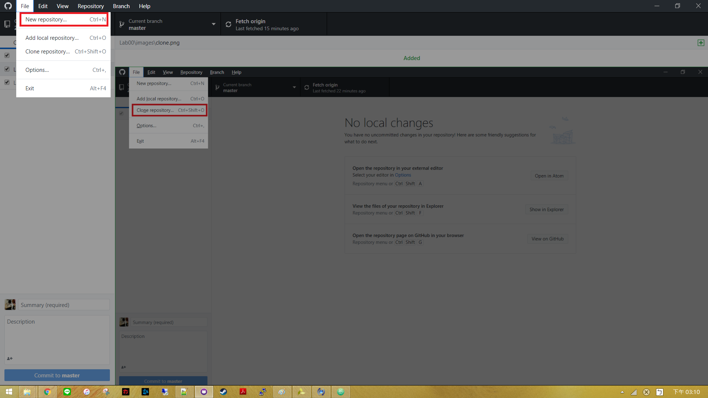

並按照下圖中格式命名後，按下 `Create repository`

**建議 : 以後的作業都直接在選項中的 Local Path 創建 Vivado 專案**

**因為只要你設定的這個 Path 有任何更動都可以直接更新到你的 Repository**

**!!!但是!!!注意!!!這點很重要!!!Vivado的專案路徑不能有中文!!!**

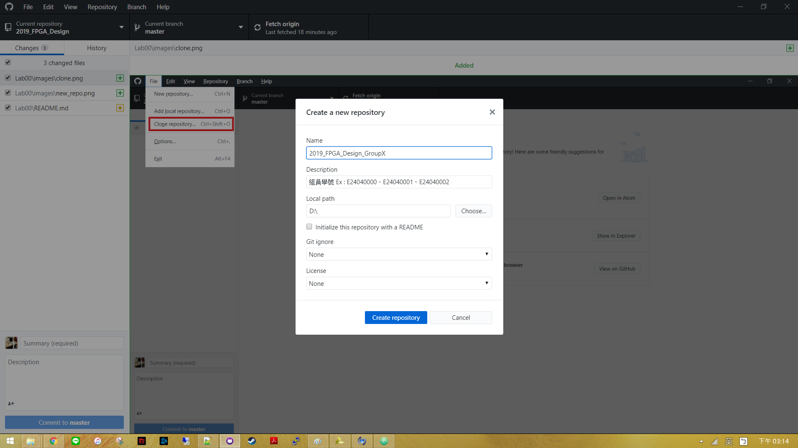

創建完 Repository 後，按下 `Publish repository`

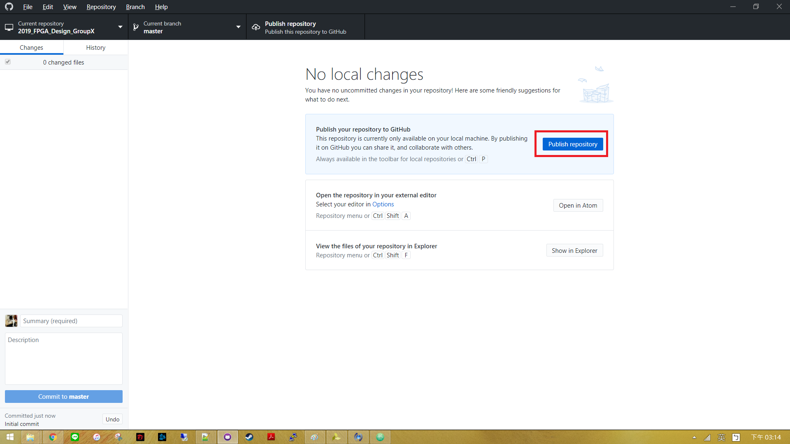

將 `Keep this code private` 取消勾選後按下 `Publish repository`

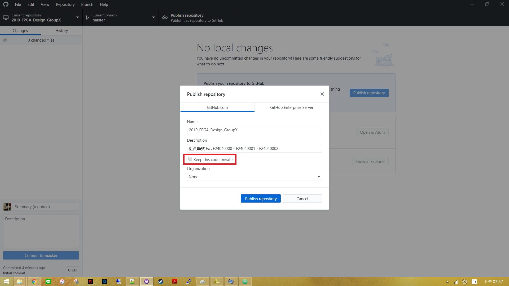

完成後在瀏覽器開啟剛剛創建的 Repository ，並將網址以及組員名單一併mail給助教(陳韋呈，主旨:2019FPGA作業網址)
> 一組請決定一個固定的網址，以後作業評分都是以這次給的網址為主

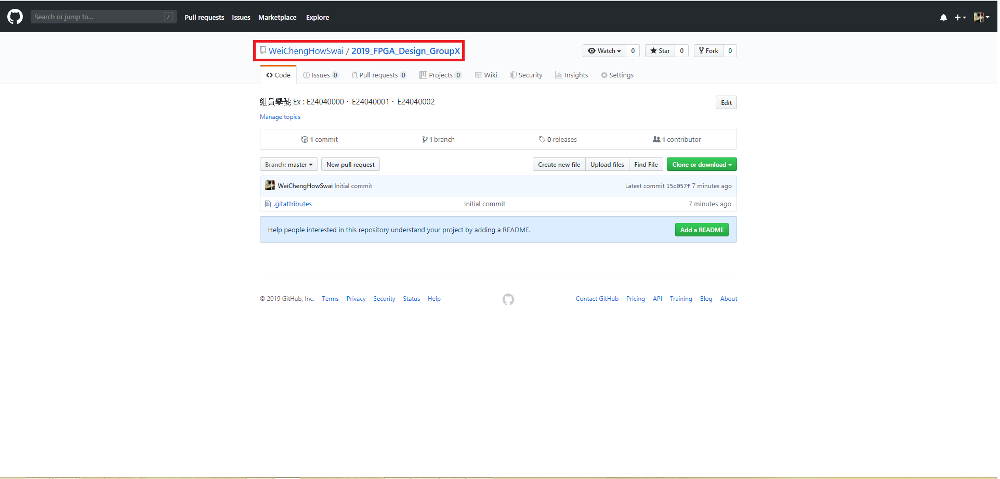

### Push to Origin

先在剛剛設定的 Local Path 下隨便建立一個 txt 檔，

再回到 Github Desktop 後，可以看到資料夾內的變更。

按下左下角的 `Commit to master `

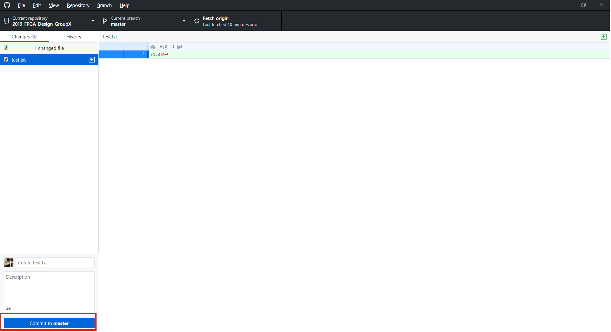

之後可以看到上方的 `Push origin` 有一個變更，給他按下去

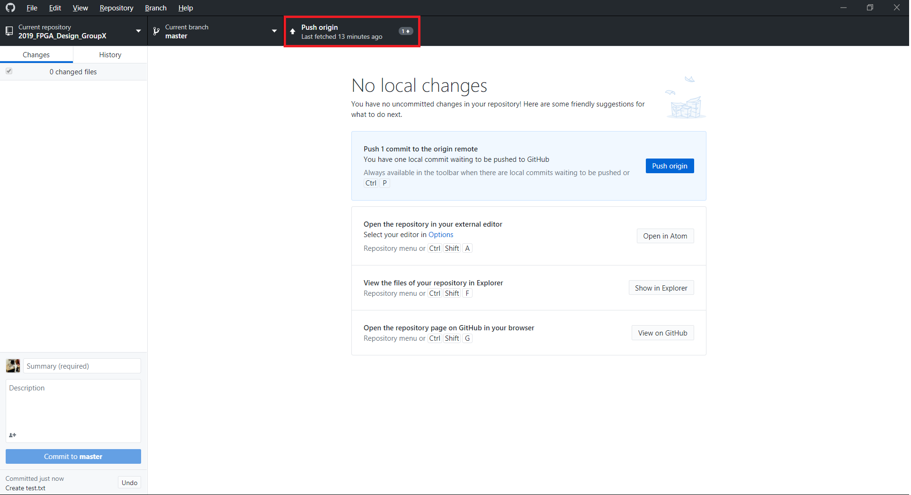

回到瀏覽器，就會發現剛剛創建的 txt 被上傳了。

# Part 2 - How to Create a Project on Vivado and Run Simulation
## Purpose

本實驗目的為讓各位了解如何將設計好的電路在 Vivado 上模擬。

## Step 1. Create a new project
首先，開啟 Vivado 軟體後會出現以下介面。
> NOTE: 此為 Vivado 2018.2 介面

選擇 Create Project 選項。

  

決定 Project 路徑及名稱後選擇 Project Type 為 RTL Project。
> NOTE: _"Do not specify sources at this time"_ 的勾選與否，會決定是否在 create project 的階段就加入 HDL files 及 constraint files

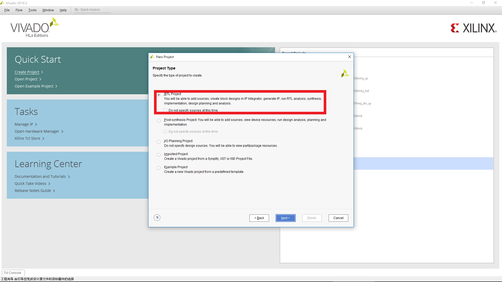

若沒勾選 _"Do not specify sources at this time"_ 則會進入 add sources and constraints 畫面。

在 Add Sources 選擇 Add Files 將放在 src 資料夾的 adder.v & tb.v 加入到這次的 Project 中。
> NOTE: Add Sources 加入或建立的檔案為 HDL files (硬體描述語言檔)

在 Add Constraints 這步驟不選擇檔案，直接按 Next 。
> NOTE: Add Constraints 加入或建立的檔案為 xdc files ， 是用來告訴 FPGA 你的電路的 I/O 腳位對應到 FPGA 上的什麼位子，這次實驗只有用到模擬功能故不需要加入 xdc files。

選擇我們要燒錄的 FPGA。
> NOTE: 這門課所使用的板子為 PYNQ-Z2，官網有提供此板子的 [board file](https://d2m32eurp10079.cloudfront.net/Download/pynq-z2.zip)。下載解壓縮後，將整個資料夾放到 Vivado 安裝目錄裡的 board_files 資料夾底下   
> "Xilinx/Vivado/2018.2/data/boards/board_files"  
> 執行此動作後須重新開啟 Vivado 才會出現此板子的選項
> NOTE: 本次Lab只會用到模擬功能，不須選擇板子。

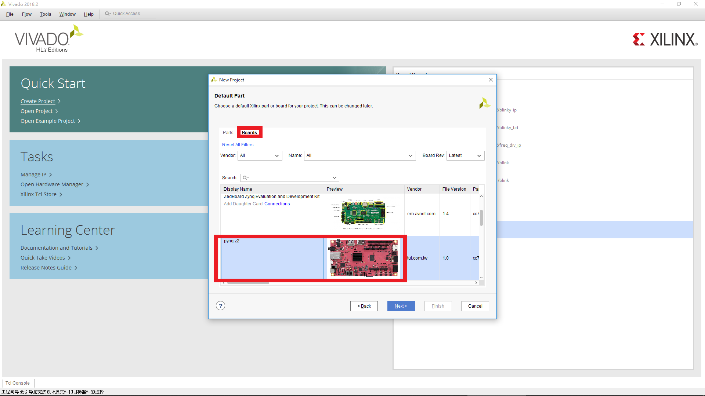

一切選擇完畢後出現以下介面，代表創建完成。

## Step 2. Simulation
在 Step 1 我們已經將本次實驗所需的 RTL code 及 Testbench 加入到 Project 中，直接按下上圖 Vivado 介面左邊 PROJECT MANAGER 中間的 Run Simulation -> Run Behavior Simulation 。

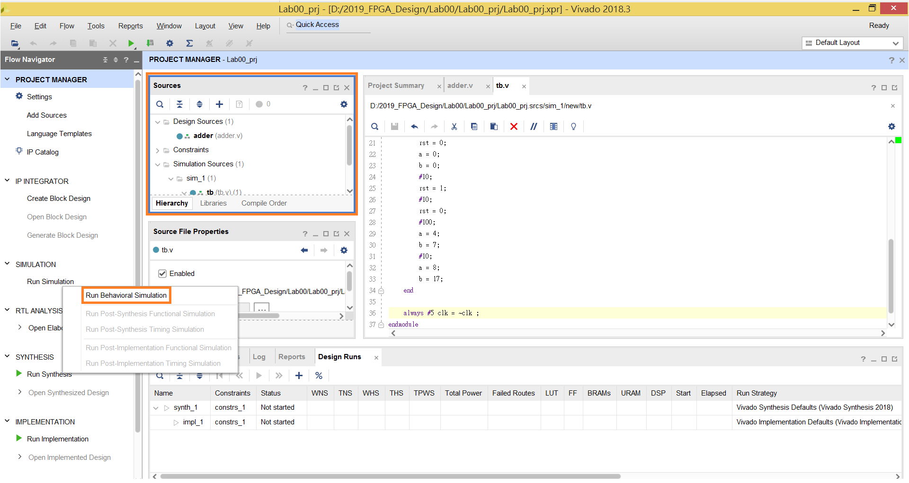

等待 Vivado 處理完成以後，就可以看模擬的波形、訊息等等資訊。

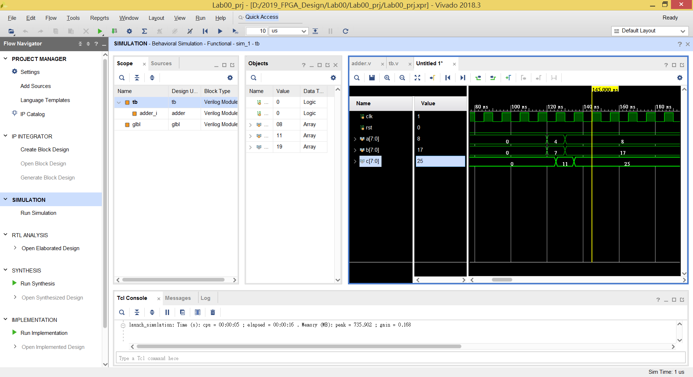
