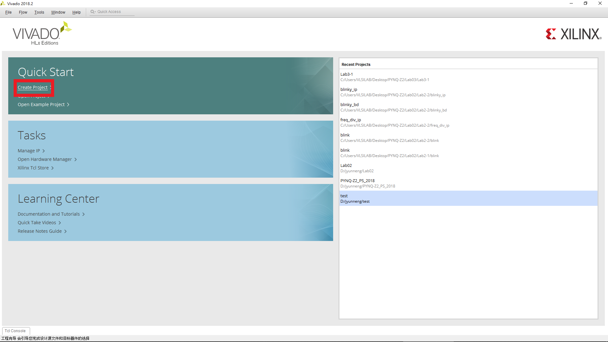
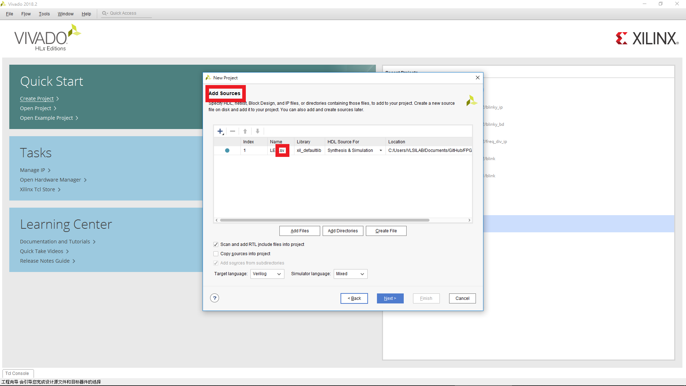
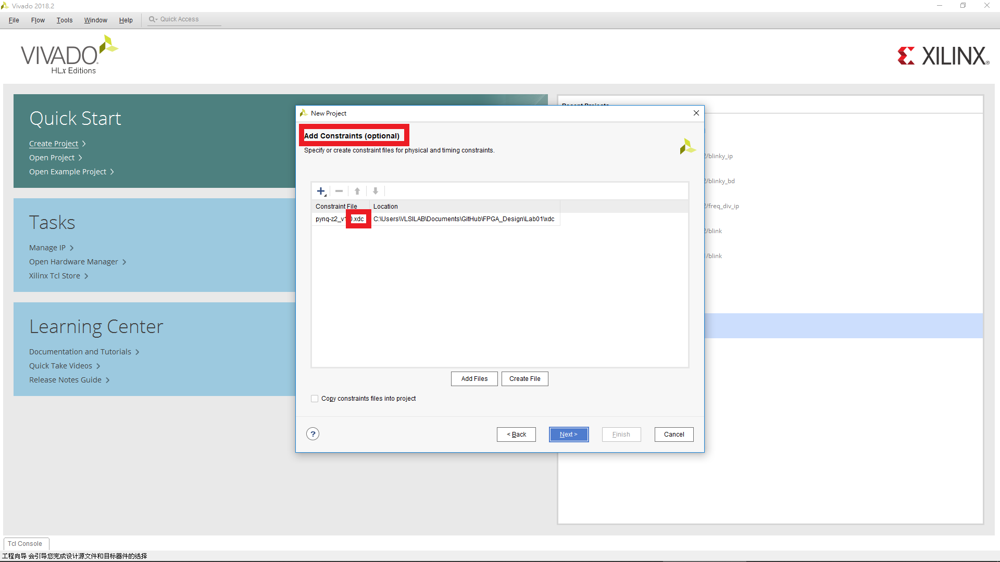
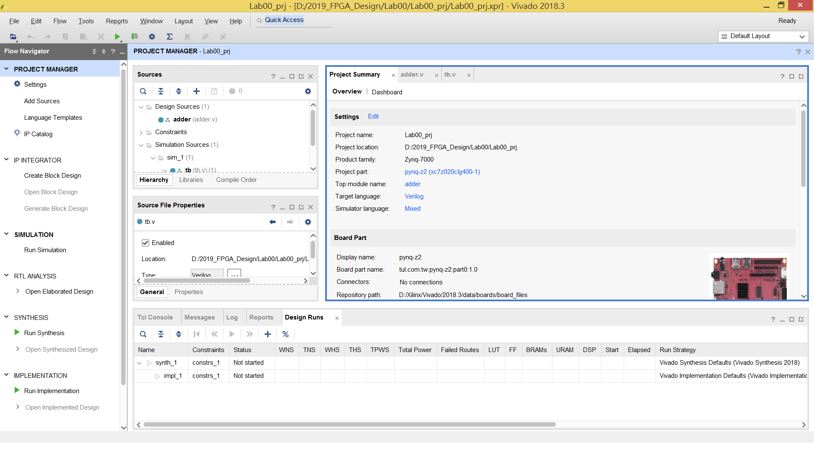
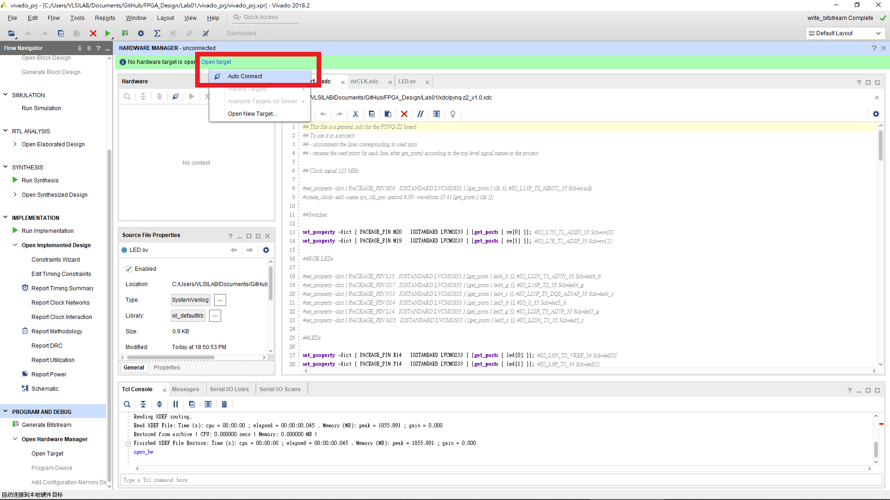
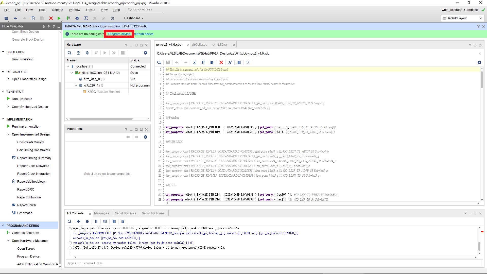

FPGA Design Lab00
===================
# Part 1 - How to Turn in Homework in This Course
## Step 1. Create a GitHub account

## Step 2. Download Git and GitHub Desktop
Here's [Git](https://git-scm.com/download/win) (For Windows)  
Here's [GithHub Desktop](https://desktop.github.com)
## Step 3. Fork this course repository

## Step 4. Pull Requests
Here's [PR tutorial](https://gitbook.tw/chapters/github/pull-request.html)

# Part 2 - How to Create a Project on Vivado and Run Simulation
## Purpose

本實驗目的為讓各位了解如何將設計好的電路燒錄到 FPGA 上執行。

## Step 1. Create a new project
首先，開啟 Vivado 軟體後會出現以下介面。
> NOTE: 此為 Vivado 2018.2 介面

選擇 Create Project 選項。

  

決定 Project 路徑及名稱後選擇 Project Type 為 RTL Project。
> NOTE: _"Do not specify sources at this time"_ 的勾選與否，會決定是否在 create project 的階段就加入 HDL files 及 constraint files

若沒勾選 _"Do not specify sources at this time"_ 則會進入 add sources and constraints 畫面。

在 Add Sources 選擇 Add Files 將放在 src 資料夾的 LED.sv 加入到這次的 Project 中。
> NOTE: Add Sources 加入或建立的檔案為 HDL files

在 Add Constraints 選擇 Add Files 將放在 xdc 資料夾的所有檔案加入到這次的 Project 中。
> NOTE: Add Sources 加入或建立的檔案為 xdc files

選擇我們要燒錄的 FPGA。
> NOTE: 這門課所使用的板子為 PYNQ-Z2，官網有提供此板子的 [board file](https://d2m32eurp10079.cloudfront.net/Download/pynq-z2.zip)。下載解壓縮後，將整個資料夾放到 Vivado 安裝目錄裡的 board_files 資料夾底下   
> "Xilinx/Vivado/2018.2/data/boards/board_files"  
> 執行此動作後須重新開啟 Vivado 才會出現此板子的選項
> NOTE: 本次Lab只會用到模擬功能，不須選擇板子。

一切選擇完畢後出現以下介面，代表創建完成。

## Step 2. Generate bitstream
在 Step 1 我們已經將本次實驗所需的 RTL code 及 constraints 加入到 Project 中，直接按下上圖 Vivado 介面左邊 PROJECT MANAGER 最下面的 Generate Bitstream，等待介面右上角顯示 write_bitstream complete 即表示完成。
> NOTE: 實際上，按下 Generate Bitstream 等同於執行了，Run Synthesis > Run Implementation > Generate Bitstream

## Step 3. Program FPGA
按下 Vivado 介面左邊 PROJECT MANAGER 最下面的 Open Hardware Manager 後會在介面中間上面出現 Open target，將板子接上電腦且開啟電源後按下 Auto Connect。
> NOTE: 若不是將板子連接在安裝此 Vivado 的電腦上，則須選擇 Open New Target 並另外設定。

選擇完畢，按下 Program device 即開始燒錄。

燒錄完成，可撥動板子上的開關觀察 LED 的亮暗情況。
