FPGA Design Lab 3-1
=================
## Purpose

使用 PYNQ-Z2 上現有的 Zynq Processor 實作一個簡單的 C/C++ Project。

## Step 1. Download PuTTY

Here's [PuTTY](https://www.putty.org/)

## Step 2. Create a new project
由於本次是使用 FPGA 上固有的 Processor，所以不需加入任何 HDL code 及 Constraints。

## Step 3. Create block design

加入 ZYNQ7 Processing System IP

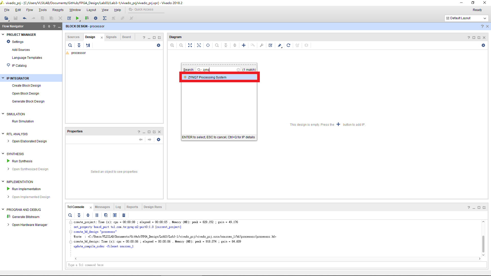

按下 Run Block Automation

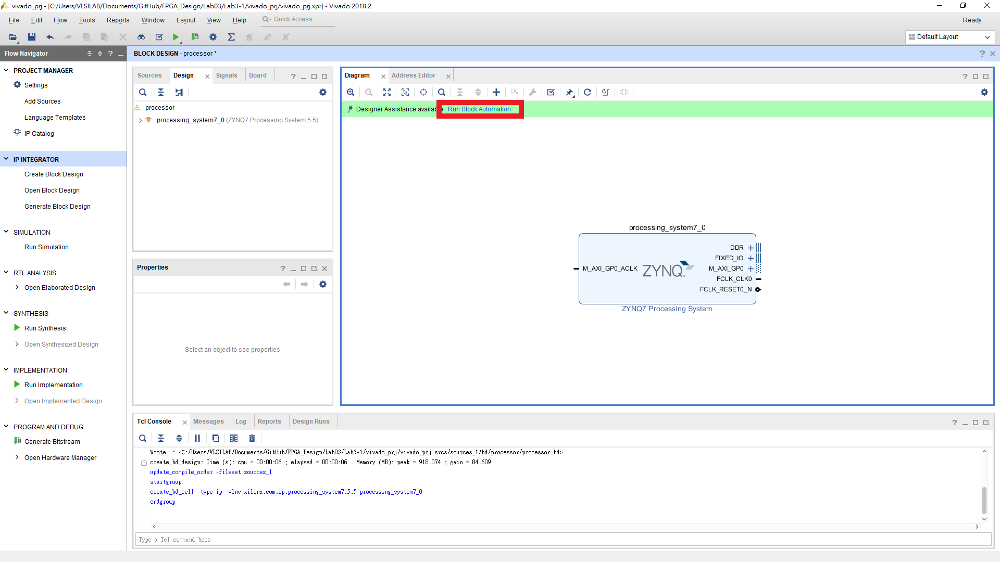

執行完畢 ZYNQ processor 會連出兩個 ports。

點開 ZYNQ processor 更改設定。本次實驗只需用到 ZYNQ processor 本身，所以要把沒用到的 I/O 取消。

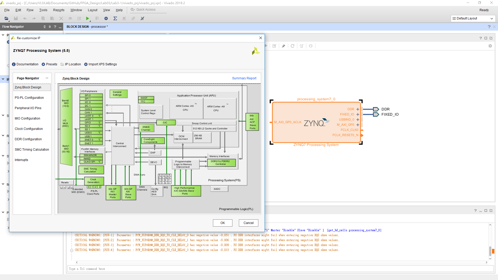

PS-PL Configurations > Gneral > Enable Clock Resets > FCLK_RESET0_N 取消勾選。  
PS-PL Configurations > AXI Non Secure Enablement > GP Master AXI Interface > M AXI GP0 Interface 取消勾選。

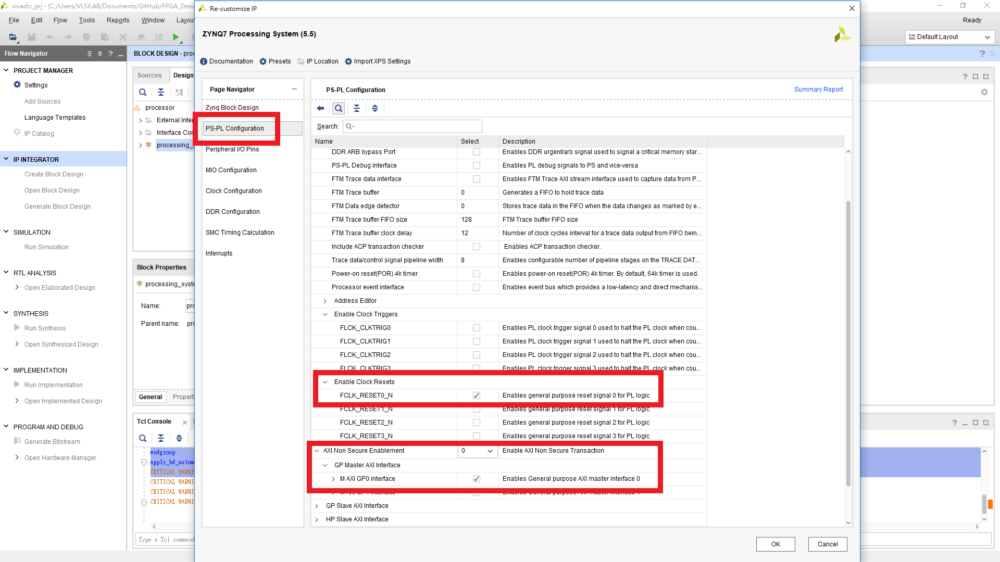

Peripheral I/O Pins 僅留下 UART0 其餘取消勾選。

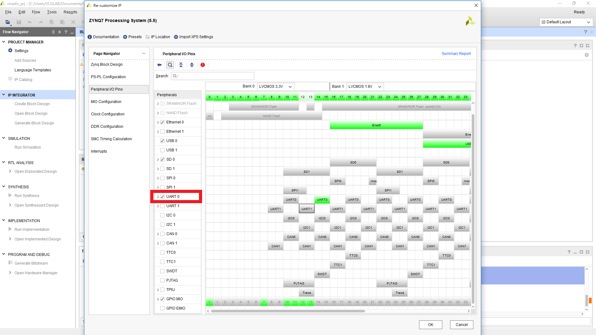

Clock Configuration > PL Fabric Clocks > FCLK_CLK0 取消勾選。

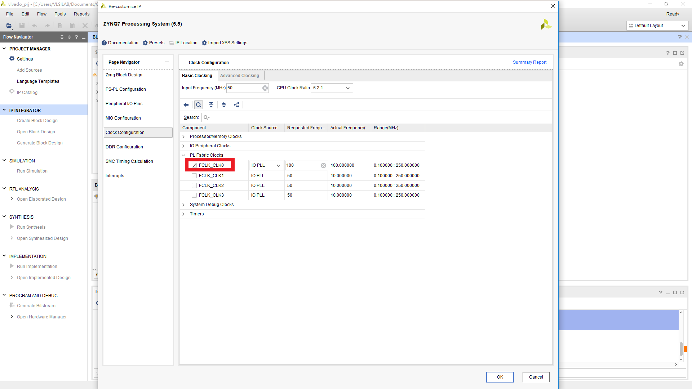

OK 後 Diagram 的 ZYNQ7 processor 會變成如下圖所示。

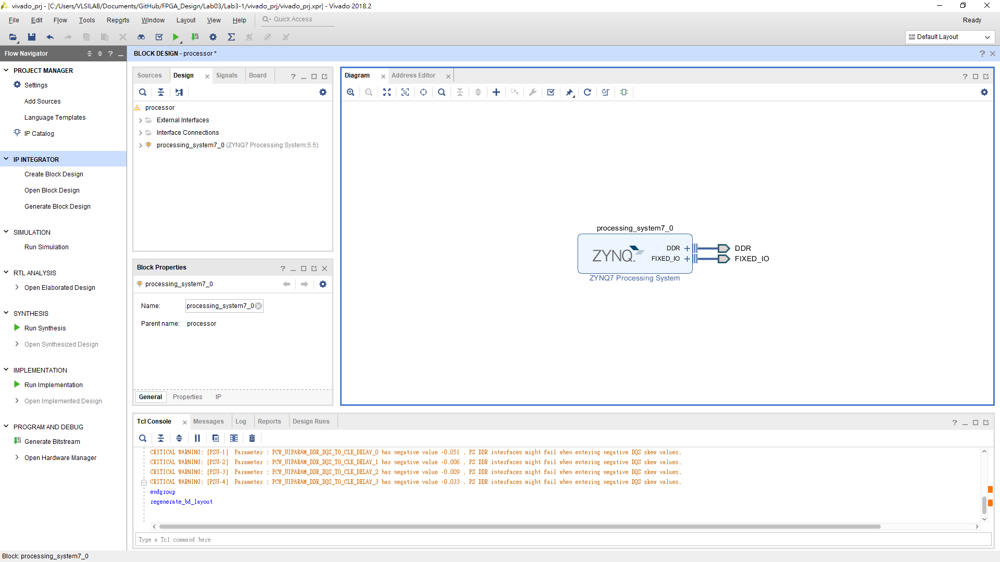

將完成的 block design 包成 HDL wrapper (Lab2-2 Step5 最後一步)。

## Step 4. Run Implementation

按下 PROJECT MANAGER > Run Implementation。
> NOTE: 由於本次實驗僅使用 ZYNQ 現有的 ARM processor，無需產生 bitstream 所以只需執行到 Run Implementation 即可。

## Step 5. Launch SDK

File > Export > Export Hardware。

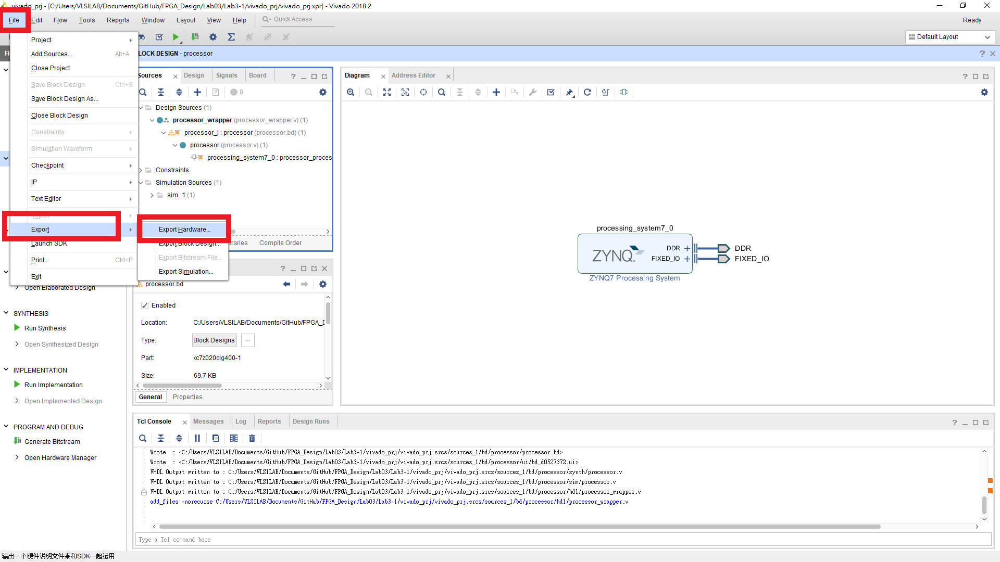

File > Launch SDK

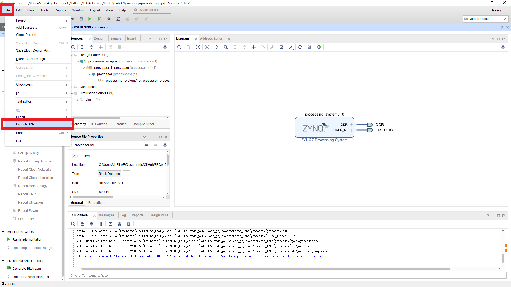

SDK GUI 如下圖所示。

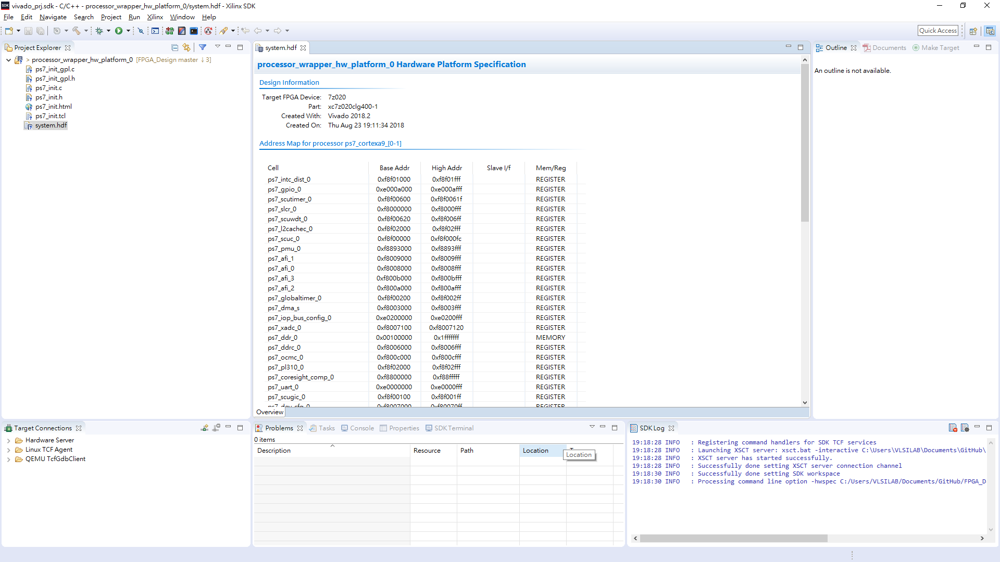

## Step 6. Write a hello world program

File > New > Application Project > 命名 > Next > Empty Application > Finish

新增空的 source file 並將 `Lab3-1/src/hello.c` 的內容貼上。

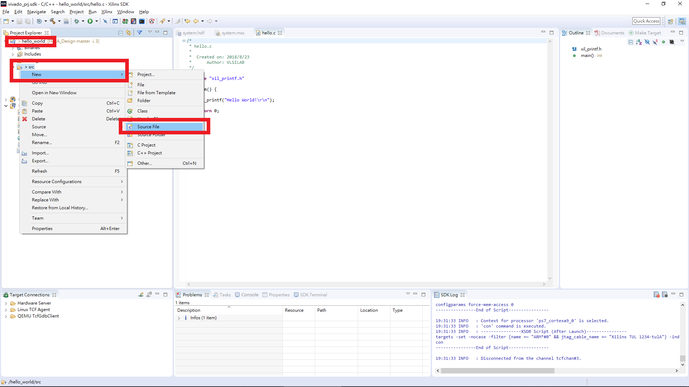

開啟 PuTTY，選擇 Serial，輸入連接 FPGA 的 COM，設定 Baud rate 為 115200。
> NOTE: 接上板子並開啟電源後 -> 在 `開始` 右鍵 -> `裝置管理員` -> `連接埠(COM和LPT)` 即可看 FPGA 是連接至哪一個 COM

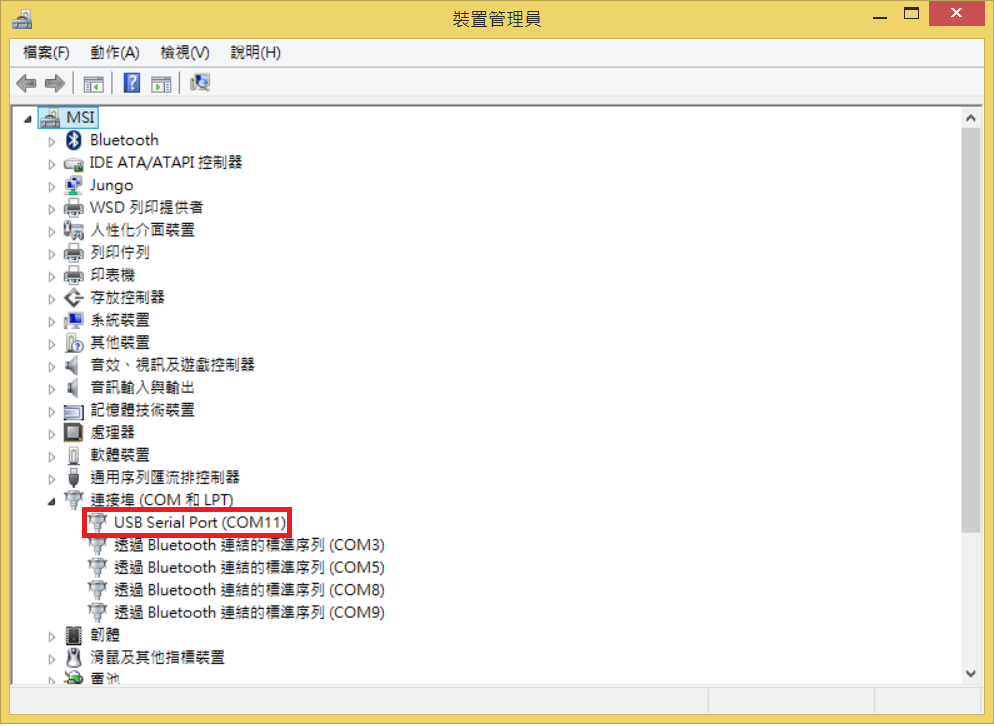

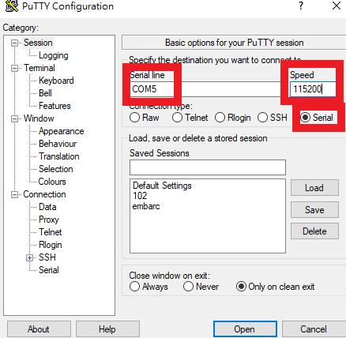

回到 SDK，Run > Run Configuration。

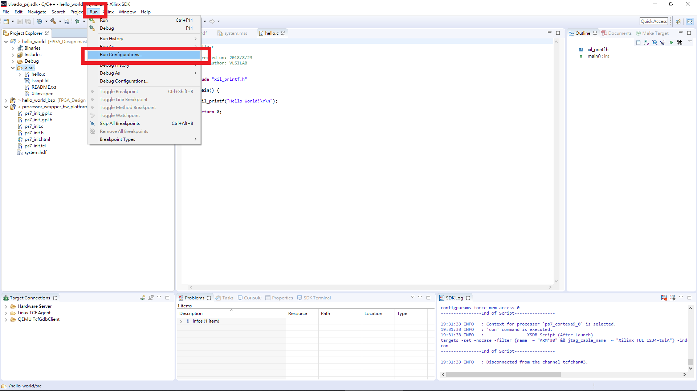

Xilinx C/C++ Application (GDB) 點兩下 > Target Setup。

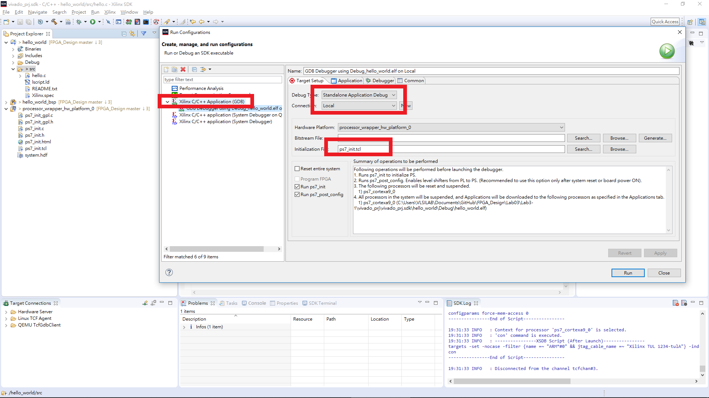

到 Application 選擇創建的 project。

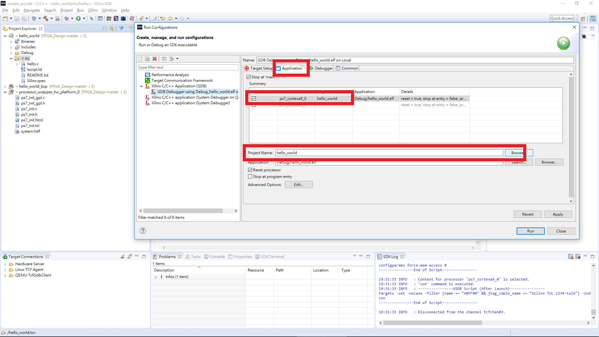

按下 Run，切換到剛剛開啟的 PuTTY 畫面會出現 "Hello World!" 表示成功。

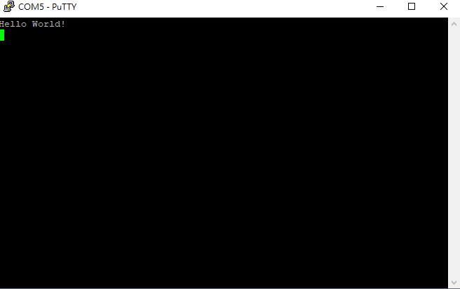
