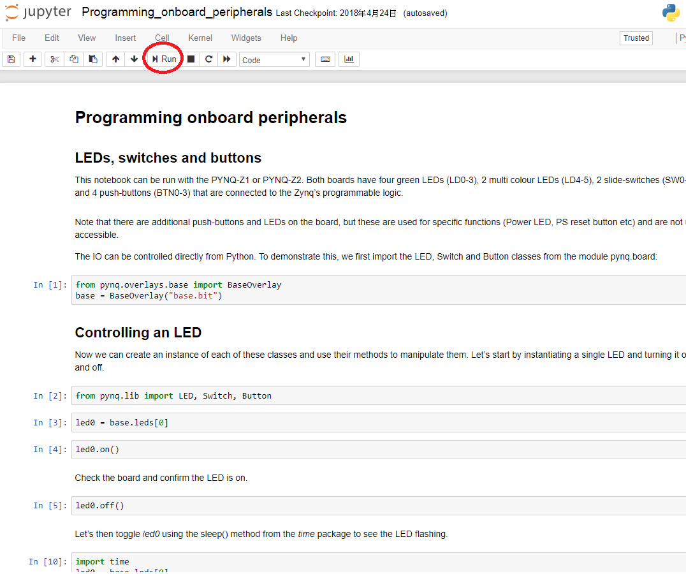

FPGA Design Lab6-1 - Python on Zynq
==================================
## Step 1 - Set up the Board

根據上圖調整板子上的設定：

1. 將開機模式調整至 `SD` 的位置。

2. 調整電源供應模式 (使用電源供應器就接 `REG`；使用 USB 供電就接 `USB`)。

3. 插入 micro SD。

4. 接上電源。

5. 插上乙太網路線，另一端與筆電連接。

6. 開機。

開啟電源後先不要動作，等待板子的 RGB LED 閃彩燈後四顆 LED 全亮紅燈才代表完全開機完成。

## Step 2 - Connect to the Board

1. `開啟網路和共用中心` -> `變更介面卡設定` -> `乙太網路` -> `內容` -> `IPv4` -> `內容`

  將 IP 位置設定為 `192.168.2.1`

  將 子網路遮罩設定為 `255.255.255.0`

2. 在檔案總管下開啟網路，可以看到一個叫做 `PYNQ` 的電腦。

  > 亦可在檔案總管輸入 `\\192.168.2.99\xilinx`

  打開後輸入帳號密碼 (皆為 `xilinx` )

3. 將本次 Lab `jupyter notebook` 資料夾內的檔案放進 PYNQ 內的 jupyter_notebooks 的資料夾內。

## Step 3 - Jupyter notebook - Base Overlay

1. 打開瀏覽器，輸入位址: `192.168.2.99:9090` (預設密碼也是xilinx)

2. 開啟 `Programming_onboard_peripherals.ipynb`

3. 按下 `run` 即可執行逐個cell裏的code

## Recommend SFTP Tool

1. [FileZilla](https://filezilla-project.org/)

2. [WinSCP](https://winscp.net/eng/download.php)
