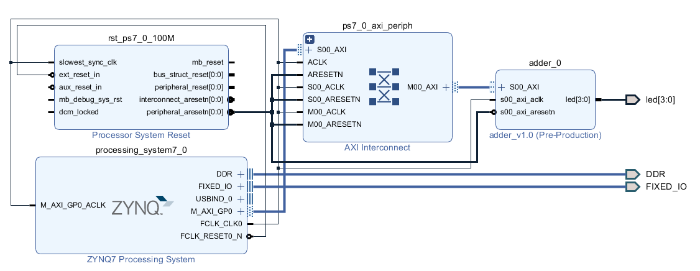
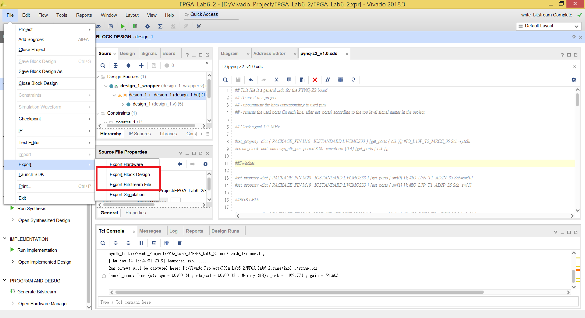

FPGA Design Lab 6-2 - Advanced Hardware Control by Python
==================================================

# Purpose

在 Pynq Jupyter Notebook 的環境下使用 Python 來控制 Custom IP

# Step 1 - Generate Bitstream

回顧 Lab4 的範例，建立一個 Block Design 並加入 Lab4 提供的範例 IP (adder)，搭建系統如下圖。

`Create HDL Wrapper` 並加入提供的 xdc 後，選擇 `Generate Bistream`。

# Step 2 - Export Hardware

產生完 Bitstream 後，分別選擇左上角的 `File` -> `Export` -> `Export Block Design`、`Export Bitstream File`

將這次設計的 Block Design 和 Bitstream File 存取出來以利等等在 Jupyter Notebook 上操作。

# Step 3 - Connect to the Board

參照 Lab6-1 ，選擇 SD 卡的開機模式連接電腦後，將上一步產生的兩個檔案以及這次實驗提供 `Lab6_2.ipynb` 放進 Jupyter Notebook 內的資料夾 ( 可以在/jupyter notebook底下新建立一個資料夾比較不會亂掉 )。

放完檔案後參照 Lab6-1 用瀏覽器開啟 Jupyter Notebook。
