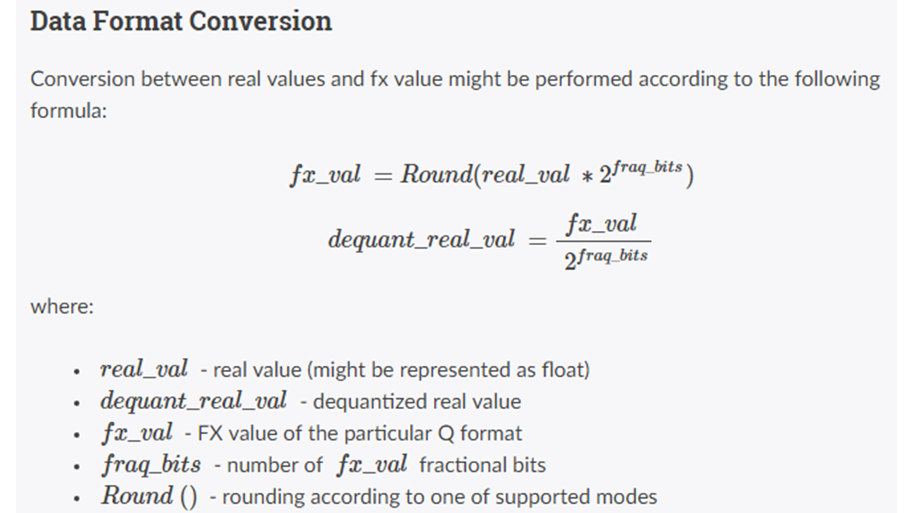

Homework 6
====

## 繳交時間

2019/12/9(Mon) 18:59 前繳交

#### 作業規定

這次作業為 **選擇性作業** ，可以自由決定要不要完成。

計分方式如下：達到指定的需求會直接在**作業總平均**上加分。

**範例：**　若前五次作業總平均為 95 ，完成 Program 1 則平均加五分變成 100。

但若前五次平均為97，完成 Program 1 平均加五分最高還是只有 100。

### Program 1. (+5)

設計一個2*2的卷積運算處理器，演算法如下。

1. 卷積運算處理器的指令及資料可以透過 BRAM ，也可以透過IP本身的 AXI Register 存取。

> 使用 BRAM 存取額外 +1分，使用 AXI Register 不額外加分。(在 README 告知)

2. 自行分配 BRAM 中存放指令及資料的位址，並要在 README 告知分配的位址。

3. 卷積運算處理器運算完後，啟動中斷訊號告知 CPU 存取 BRAM 中的運算結果。 (非必要)

4. IP 可以為 AXI IP ，亦可為一般 Custom IP。

5. 使用定點數運算的組別可以在軟體做定點數轉換的處理，將定點數輸入處理器並取出定點數結果，再轉換回實際值即可。

### Data Type

#### 備註 : 這次作業主要是要讓 Final Project 要挑戰 CNN 的組別當作練習

在硬體運算中，不像軟體運算會有小數點的存在。

因此我們必須在設計的時候，使用 **定點數運算** 。

使用小數定點數運算的組別，額外+1分。

使用純整數運算的組別，不額外加分。

#### 定點數運算

##### Abstract

將小數透過演算法轉換成整數，並記下當下小數點的位置。

在運算同時處理運算結果的小數點位置，並將結果轉換回小數。

[Reference](https://embarc.org/embarc_mli/doc/build/html/MLI_FP_data_format/MLI_FP_data_format.html)

##### Fix-Point Data Format

**格式表示法** : `Qm.n` 表示這個數由 m-bit 的整數以及 n-bit 的小數所組成。

**範例** : 以 8-bit 的容器為例， `01000000` 這個定點數值在不同的格式下所代表的實際值就會不同。(第一個 bit 為 sign-bit)

在 `Q0.7` 的格式下代表實際值是 `0.5`

在 `Q1.6` 的格式下代表實際值是 `1.0`

###### Data Format Conversion Between Fix-Point and Real Value

**範例1-實際值轉定點數**

real value 0.85 in FX format Q0.7 ; rounding mode : nearest

FX_val = round(0.85*(2^7))=round(108.8)= 109 (0x6D)

**範例2-定點數轉實際值**

FX_val = 109 in FX format Q.7

real value = 109/2^7 = 0.8515625

##### 定點數運算

**加/減法** : 兩**同格式**定點數可以直接相加減，運算後定點數格式不變。

**乘法** : 兩**不同格式**定點數可以直接相乘，運算後定點數格式改變如下：

Given x in `Q4.3` , y in `Q5.7`

x * y will be in Q(4+5).(3+7) = `Q9.10`

**除法**：兩**不同格式**定點數可以直接相除，運算後定點數格式改變如下：

Given x in Q16.12 , y in Q10.9

x/y will be in Q(16-10).(12-9) = Q6.3
