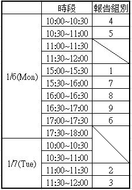

Undergraduate course -- FPGA Design
=================

This repository provides various FPGA design tutorials.

# Final Project Presentation Agenda

以下為期末專題報告的注意事項：

1. 報告地點為超大型積體電路設計實驗室 (奇美樓 5F 95514室)
2. 請於報告前五分鐘到實驗室報到
3. 報告用的投影片請在報告前一天前寄到這個信箱，並在標題加上【FPGA期末專題PPT】，並註明組別
4. 請一併將板子、線材、記憶卡帶來歸還

# Tool
* [Vivado 2018.3](https://www.xilinx.com/support/download/index.html/content/xilinx/en/downloadNav/vivado-design-tools/2018-3.html)

# FPGA Development Board

* [PYNQ-Z2 board](http://www.tul.com.tw/ProductsPYNQ-Z2.html)

# Learning Resource

* [Xilinx Online Video](https://www.xilinx.com/video.html)

* [Digilent Programmable Logic Tutorials ](https://reference.digilentinc.com/learn/programmable-logic/tutorials/start)

* [Zynq-7000 All Programmable SoC: Embedded Design Tutorial](https://ppt.cc/f4Leqx)

* [Vivado Design Suite User Guide](https://ppt.cc/fyFDXx)
> Appendix A -> References

* [PYNQ](http://www.pynq.io)

# GitHub Learning Resource

* [30天精通Git版本控管](https://ithelp.ithome.com.tw/users/20004901/ironman/525)
* [Git Cheat Sheet](https://services.github.com/on-demand/downloads/github-git-cheat-sheet.pdf)
* `git --help`

# SystemVerilog
* [IEEE Standard for SystemVerilog](https://ieeexplore.ieee.org/document/8299595)

# Verilog
* [IEEE Standard for Verilog](https://ieeexplore.ieee.org/document/1620780)

# Teaching Assistance

**來信請在標題加上【FPGA】**

**範例:【FPGA】Homework3 Problem1問題**

* 許軒瑞:N26074906@mail.ncku.edu.tw
* 陳韋呈:N26084723@mail.ncku.edu.tw
